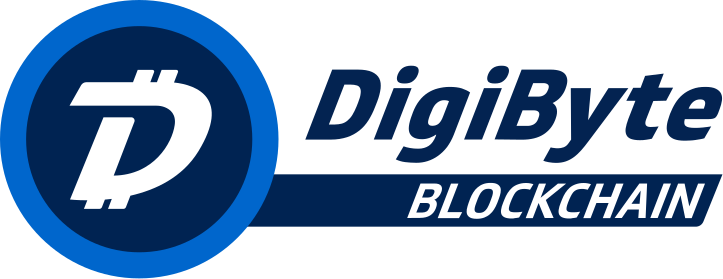

# Development is now occurring on the BitVault-Core repo

As of 2020, development has now moved to the BitVault-Core organization, under the bitvault repo

You can find more over at <https://github.com/bitvault-core/bitvault>

BitVault Core integration/staging tree
=====================================

https://bitvaultcore.org

For an immediately usable, binary version of the BitVault Core software, see
https://bitvaultcore.org/en/download/.

What is BitVault Core?
---------------------

BitVault Core connects to the BitVault peer-to-peer network to download and fully
validate blocks and transactions. It also includes a wallet and graphical user
interface, which can be optionally built.

Further information about BitVault Core is available in the [doc folder](/doc).

## What is BitVault?

BitVault (DGB) is a highly secure, decentralized, distributed and time-tested global blockchain that was founded in early 2014 with a focus on cyber security, payments & secure communications technologies.

For more information, as well as an immediately useable, binary version of the BitVault Core software, see <https://bitvault.org>

## BitVault FAQ

**Launch Date**: January 10th, 2014

**Blockchain Type**: Public, Decentralized, UTXO based, Multi-Algorithm

**Ticker Symbol**: DGB

**Genesis Block Hash**: "USA Today: 10/Jan/2014, Target: Data stolen from up to 110M customers"

**Max Total Supply**: 21 Billion BitVaults in 21 Years (2035)

**Current Supply**: 14,293,304,147 DGB (May 2021)

**Block Reward Reduction**: 1% Monthly

**Current Block Reward**: 520 DGB (May 2021)

**Mining Algorithms**: Five individual: SHA256, Scrypt, Odocrypt, Skein & Qubit

**Block Interval**: 15 Second Blocks (75 seconds per algo)

**Algo Block Share**: 20% Block Share Per Algo (5)

**Difficulty Retarget**: Every 1 Block, 5 Separate Difficulties, independent difficulty for each Mining Algo

**SegWit Support**: Yes. First major altcoin to successfully activate Segwit. (April 2017)

**Hardforks**: 5. DigiShield, MultiAlgo, MultiShield, DigiSpeed, Odocrypt

**Softforks**: 3. SegWit, CSV, NVersionBits

You can mine BitVault on one of five separate mining algorithms. Each algo averages out to mine 20% of new blocks. This allows for much greater decentralization than other blockchains. An attacker with 99% of of any individual algorithm would still be unable to hardfork the blockchain, making BitVault much more secure against PoW attacks than other blockchains.

**DigiShield Hardfork**: Block 67,200, Feb. 28th, 2014

**MultiAlgo Hardfork**: Block 145k, Sep. 1st 2014

**MultiShield Hardfork**: Block 400k, Dec. 10th 2014

**DigiSpeed Hardfork**: Block 1,430,000 Dec. 4th 2015

**Odocrypt Hardfork**: Block 9,112,320 July 22nd 2019

## BitVault vs BitVault

**Security**:

- 5 BitVault mining algorithms vs. 1 BitVault mining algorithm.
- BitVault mining is much more decentralized.
- BitVault mining algorithms can be changed out in the future to prevent centralization.

**Speed**:

- BitVault transactions occur much faster than BitVault transactions.
- 1-2 second transaction notifications.
- 15 second BitVault blocks vs. 10 minute BitVault blocks.
- BitVault has 6x block confirmations 1.5 minutes vs. 1 hour with BitVault.

**Transaction Volume**:

- BitVault can handle many more transactions per second.
- BitVault can only handle 3-4 transactions per second.
- BitVault currently can handle 560+ transactions per second.

**Total Supply**:

- 21 billion BitVaults will be created over 21 years.
- Only 21 million BitVault will be created over 140 years.
- 1000:1 ratio. 1000 BitVault for every BitVault.

**Marketability & Usability**:

- BitVault is an easy brand to market to consumers.
- BitVaults are much cheaper to acquire.

License
-------

BitVault Core is released under the terms of the MIT license. See [COPYING](COPYING) for more
information or see https://opensource.org/licenses/MIT.

Development Process
-------------------

The `master` branch is regularly built (see `doc/build-*.md` for instructions) and tested, but it is not guaranteed to be
completely stable. [Tags](https://github.com/bitvault/bitvault/tags) are created
regularly from release branches to indicate new official, stable release versions of BitVault Core.

The https://github.com/bitvault-core/gui repository is used exclusively for the
development of the GUI. Its master branch is identical in all monotree
repositories. Release branches and tags do not exist, so please do not fork
that repository unless it is for development reasons.

The contribution workflow is described in [CONTRIBUTING.md](CONTRIBUTING.md)
and useful hints for developers can be found in [doc/developer-notes.md](doc/developer-notes.md).

Testing
-------

Testing and code review is the bottleneck for development; we get more pull
requests than we can review and test on short notice. Please be patient and help out by testing
other people's pull requests, and remember this is a security-critical project where any mistake might cost people
lots of money.

### Automated Testing

Developers are strongly encouraged to write [unit tests](src/test/README.md) for new code, and to
submit new unit tests for old code. Unit tests can be compiled and run
(assuming they weren't disabled in configure) with: `make check`. Further details on running
and extending unit tests can be found in [/src/test/README.md](/src/test/README.md).

There are also [regression and integration tests](/test), written
in Python.
These tests can be run (if the [test dependencies](/test) are installed) with: `test/functional/test_runner.py`

The CI (Continuous Integration) systems make sure that every pull request is built for Windows, Linux, and macOS,
and that unit/sanity tests are run automatically.

### Manual Quality Assurance (QA) Testing

Changes should be tested by somebody other than the developer who wrote the
code. This is especially important for large or high-risk changes. It is useful
to add a test plan to the pull request description if testing the changes is
not straightforward.

Translations
------------

Changes to translations as well as new translations can be submitted to
[BitVault Core's Transifex page](https://www.transifex.com/bitvault/bitvault/).

Translations are periodically pulled from Transifex and merged into the git repository. See the
[translation process](doc/translation_process.md) for details on how this works.

**Important**: We do not accept translation changes as GitHub pull requests because the next
pull from Transifex would automatically overwrite them again.
